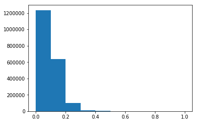
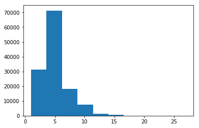
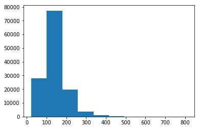

# Week 5 Report

## Report

1. PGNet
2. Winograd - decode
3. Winograd - Score (both PGNet and original model) (now?)
4. ReasonQA
   - Pipeline of DrQA
   - Context retrieval

## Note

1. We fixed a tokenization problem in Gigaword and News Crawl such as n ' t and ' m.
2. We fixed another tokenization problem caused by Stanford NLP pipeline, map -LRB- to original brackets and such.

## Learning to Explain

**PGNet**

We evaluate PGNet on Winograd schema. With PGNet, we cannot supply target and evaluate the perplexity on the Gold sentence.

```bash
# original dataset
CUDA_VISIBLE_DEVICES=0 python3.6 translate.py -model save/because_transformer_copy_attn_sep24/dissent_step_200000.pt -src data/src-test.txt -share_vocab -output save/because_transformer_copy_attn_sep24/dissent_step_200000_pred.txt -replace_unk \
     -report_bleu -report_rouge -batch_size 512 -gpu 0 -beam_size 1

# winograd schema
CUDA_VISIBLE_DEVICES=1 python3.6 translate.py -model save/because_transformer_copy_attn_sep24/dissent_step_200000.pt -src  data/winograd/src-wsc62.txt \
  -share_vocab -output  data/winograd/wsc_62_pgnet_dissent_step_200000_pred.txt -replace_unk \
     -report_bleu -report_rouge -batch_size 512 -gpu 0 -beam_size 1 
```

We can notice that PGNet has slightly lower validation accuracy.

The sentences however appear to be longer, more varied. However, there is no clear evidence that PGNet copied anything.

Hypothesis: S2 and S1 actually do not overlap. PGNet will be more useful in the situation where context is provided.

**Source of Explanation**



The overall picture shows that most S1 and S2 are very different, very small overlap. We decide to then zoom into the 0.0 to 0.1 range. There are some overlap, but not many.


Refer to an analysis on overlap in the slides!

TODO: Can augment this analysis by using NER to find named entity (like names) overlap, or use POS to find noun overlap.

**Evaluate on Winograd Schema**

[link](http://nbviewer.jupyter.org/github/windweller/DisExtract/blob/edge/models/notes/assets/week3/Winograd%20S2%20Generation.ipynb)

**Evaluation**

- Plausibility
- Compare to other chit-chat chatbot's ability to generate ([PERSONA-CHITCHAT](https://arxiv.org/pdf/1801.07243.pdf)) (still depends on turning S1 into Question)

## ReasonQA

Title - ReasonQA: Learning to Explain Through Automatic Dataset Creation

### Processing Ordered News Crawl

We go back to 10 before 10 sentences after strategy.

ReasonQA is a bit different from SQuAD and CoQA. It's prohibitively abstractive. The paragraph only provides context, but does not include the actual answer. It also does not try to match and detect `because`, and generate whatever is after `because`. However, the paragraph might still contain `because` sentences. It only will not contain the S1(Q) nor S2.

It is generating the best explanations, asking to reason about what are the plausible scenarios that could happen under that context.

We processed the new corpora, which is 43G with all file structure. This is different from the originally shuffled dataset, which is about 22 GB in total. The final tokenized file has 27GB in total, compared to originally extracted dataset that also has 22 GB storage. The new tokenized file has **233,195,563 (233M)** sentences. The original file only had **191M** sentences.

We compare if this new 27GB file can give us more `because` sentence pairs! We investigate by filtering first.

* We obtained **3,743,177 (3.7M)**  `because` sentences, with just filtering. Compared to **3.1M** sentences filtered through.
* After parsing, we get **2,074,926 (2.07M)** sentences. This is slightly fewer than **2.09M** that we get from shuffled data. This could be due to randomness? Some spot check shows that dataset does overmatch significantly.
  * We use a Jupyter Notebook to do some more investigation
  * Turns out, we have more. After collapsing the repeating entries, we get **1,980,127** pairs, compares to **1,886,580** pairs. Also the `ordered` corpus includes 2018 Feb crawling. Shuffled corpus only covers 2017.
* Spot check also shows that many S1 overlap, with different S2 generated. This raises the question on whether we can retrieve the correct context with current strategy.
* We process the news articles and seperate them. We have title and main text of each news article now, which somewhat resembles Wikipedia.
* After the split, the data shows: 2099723/91293/91292
* After retrieving context, we have: 2099719/91293/91292

### Retrieving Context

In DrQA section 4.4: "Distantly Supervised Data", DrQA pipeline is

1. Use Doc Retriever to get top 5 Wikipedia articles.
2. All paragraphs in these articles without an exact match of the known answer are directly discarded. Then length filter (25<x<1500).
3. Named entity in question, delete paragraphs without named entity.
4. Score all positions that match an answer using unigram/bigram overlap with answer. Keep the top 5 paragraphs with the highest overlap.

We also have a quick comparison against SQuAD:

SQuAD distribution of sentence length:



The mean is about 5 sentences in total.

SQuAD distribution of word length:



The mean is 140 words.

CoQA passage length is around **200-300** words. It's longer than SQuAD.

We explore two ways of building/training our model:

**Schema A**

We match the sentence back to the tokenized file, and grab +5/-5 sentences, and use this as context.

- Might make more sense since the context does not need to contain overlapping words as in S1 or S2.
- So turns out, Schema B might not work so well because the word overlap. However, the DB with retrieval can help us figure out exactly where our extract sentence is in the original corpus! And since Schema B extracted context anyway, we can just grab those context and use it for Schema A!

```bash
python3.6 gen_qa_because.py --corpus because_qa --out_prefix gigaword_newscrawl_ctx_s1_s2_2018oct2 --data_json ./corpus/because/because_db_buffer10.txt --model ./corpus/because/because_db_buffer10-tfidf-ngram=2-hash=16777216-tokenizer=simple.npz --train_size 0.92

# multi-processing
python3.6 gen_qa_because.py --corpus because_qa --out_prefix gigaword_newscrawl_ctx_s1_s2_2018oct2 --data_json ./corpus/because/because_db_buffer10.txt --model ./corpus/because/because_db_buffer10-tfidf-ngram=2-hash=16777216-tokenizer=simple.npz --train_size 0.92 --workers 12

# run on CCN
python gen_qa_because.py --corpus because_qa --out_prefix gigaword_newscrawl_ctx_s1_s2_2018oct2 --data_json /mnt/fs5/anie/DisExtract/preprocessing/corpus/because/because_db_buffer10.txt --model /mnt/fs5/anie/DisExtract/preprocessing/corpus/because/because_db_buffer10-tfidf-ngram=2-hash=16777216-tokenizer=simple.npz --train_size 0.92 --workers 46

# process for only before
python gen_qa_because.py --corpus because_qa --out_prefix gigaword_newscrawl_ctx_before_5_s1_s2_2018oct5 --data_json /mnt/fs5/anie/DisExtract/preprocessing/corpus/because/because_db_buffer10.txt --model /mnt/fs5/anie/DisExtract/preprocessing/corpus/because/because_db_buffer10-tfidf-ngram=2-hash=16777216-tokenizer=simple.npz --train_size 0.92 --workers 30 --only_before --context_len 5
```

Currently this schema is a bit slow...we might actually just resort back to matching directly from context. Multiprocessing helps.

This takes about 2.2 days to process. There are **62,238** misses. We calculate misses as the number of sentences in the context that we couldn't retrieve by enumerating the index.

We also have a version where we grab the 5 previous sentences.

**Schema B**

We store +5/-5 sentences in the database and use tf-idf hashed retrieval to obtain best candidate context sentences. This is closer to the Distant Supervision method used in DrQA paper, so probably more grounded.

- We can try this appraoch first and verify whether this works or not! If not, we can always to go to Schema A.

More of a DrQA approach, also can be useful for future use

Build a database of news articles from 2007-2018.2. Retrieve context based on the hashing scheme proposed by Document Retriever.

This strategy should work now that we get news crawl in order.

```bash
cd ~/DisExtract/preprocessing
python drqa_preprocess.py

# build dataset
cd ~/DrQA/scripts/retriever
python3 build_db_single_file.py /home/anie/DisExtract/preprocessing/corpus/because/because_db_buffer10.txt /home/anie/DisExtract/preprocessing/corpus/because/because_db_buffer10.db

python3.6 build_tfidf.py /home/anie/DisExtract/preprocessing/corpus/because/because_db_buffer10.db  /home/anie/DisExtract/preprocessing/corpus/because/ --num-workers 8

python3 interactive.py --model /home/anie/DisExtract/preprocessing/corpus/because/because_db_buffer10-tfidf-ngram=2-hash=16777216-tokenizer=simple.npz --data_json /home/anie/DisExtract/preprocessing/corpus/because/because_db_buffer10.txt --filter
```

This way, we turn a 300M news article into a database of 49M entries.

### S1 to Question

We use SRL to turn S1 into a question! 

## ReasonQA Evaluation

**Tasks**:

1. Intrinsic evaluation: F1 score (between gold ref and candidates)
2. Direct evaluation on Why questions in SQuAD and CoQA
3. Serve as pretraining for PGNet for SQuAD and CoQA. (Improve performance of PGNet without DrQA)
   - Might need to compare against other LM type Transformer pre-training :)