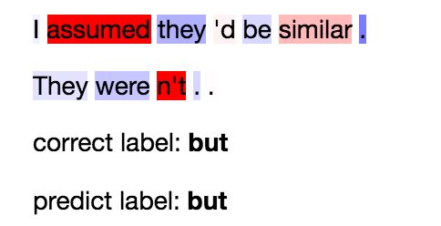
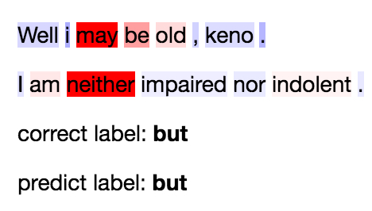
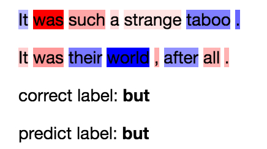
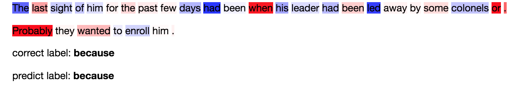
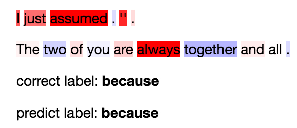
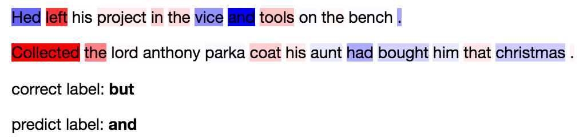

# Week 1 Report

## Outline

1. We investigated **old** experiment data, we can't conclude that `because` is learned badly because algorithms fail to understand causal relations (or acquire real-world knowledge) (confounding factor: number of training examples in corpus)
2. We then follow up with **balanced experiments**. We conclude that both `because` and `but` are the hardest discourse markers to learn. We note that increasing hidden state dimension is only helpful for generalization, not necessary for the task itself.
3. Analyze the error examples with visualization. 
4. Preprocessed English Gigaword (newswire). Preliminary pre-processing is finished. Want to know how to move forward.

## Preprocessing Gigaword

Gigaword english has **116,456,445** (**116M**) raw sentences in total. Since this is a very large corpus, we only select `because` marker to make the process simpler.

We found **1,287,503** (**1.2M**) sentences that contain `because` (we filtered out `because of`). After parsing the number will get smaller, but will still be substantial.

## Analyze and Visualize Examples

We use contextual decomposition on LSTM to visualize each word's contribution to the final prediction. This method does not take into account of word interactions, but rather provides a clear picture on how and whether each word will have a large influence over the final prediction.

The code has been finished and the result can be seen in [Visualization Notebook Link](http://nbviewer.jupyter.org/github/windweller/DisExtract/blob/edge/models/DisExtract%20Books%205%20Error%20Analysis.ipynb).

We use the [contextual decomposition](https://arxiv.org/pdf/1801.05453.pdf) technique. The core idea of this method is to:

$h_t = \mathrm{rel}_t + \mathrm{irrel}_t$

We break down each hidden state into a "relevant" vector and a "irrelevant" vector. We are working with a special case where we only look at each word's contribution to the final prediction, ignoring the interactions that happen between the time steps.

After breaking each hidden state down, we then use $rel_t \times \frac{\nabla \hat y_i}{\nabla h_t}$, the gradient to the hidden state as it's influence to the final prediction.

(LaTex does not render on github, the above paragraph can be found in Jupyter Notebook linked above)

Limitations of the current approach: good interpretation methods in LSTM is still under development. DIS task (like SNLI), is about relations between two sentences. Current highlight only shows considering the other sentence fixed, what are the important words/phrases that increase the likelihood of predicting a certain label. It does not shed light on the relations between two words in two sentences.

**General observations:**

1. BookCorpus has both the advantage and disadvantage that it is a corpus made of stories. For causal relations, I was hoping to extract causal pairs of events or entities ("A" -> "B"). This could happen with Gigaword (Newswire) but not so much with BookCorpus.

**"But" observations:**

1. Contrast phrases are picked up, such as "assumed" vs. "n't" or "may" vs. "neither".

   

   

2. Sometimes model picks up really striking pairs that at first glance doesn't make sense, but after some thought, it does make sense. For example, "love" indicates present, but "years" indicate distant future, and these two events contrast.

   

3. Clearly certain `but` usages are very hard to rationalize...but the model makes a successful prediction anyway:

   

**"Because" observations:**

1. Phrases like **simply because** or **probability because** or **partially because** are identified.

   

   

2. A lot of verbs are being highlighted.

   

3. A **claim** in sentence A, and then **support** in sentence B indicates an explanation.

   

**Label is ambiguous and model still made a good call:**

There are a few examples where clearly the model makes a good call:

## Balanced experiments

We follow up on a balanced corpus, where we threshold every marker to be the same as the least frequent marker. We run two experiments: balanced books 5 and balanced books all. Since we no longer consider generalization, we vary the hidden states size from 1024, 2048, to 4096. 

Books ALL balanced: **181,184** training examples, each marker has **13,421** examples.

Books 5 balanced: **836,790** training examples, each marker has **167,358** examples.

**Books ALL Model Performance**

| Model | Epoch | Accuracy | Precision | Recall | F1   |
| ----- | ----- | -------- | --------- | ------ | ---- |
| 1024  | 9     | 46.0     | 46.8      | 46.8   | 46.8 |
| 2048  | 7     | 46.0     | 47.6      | 46.9   | 47.0 |
| 4096  | 7     | 47.0     | 47.4      | 47.1   | 47.1 |

(Report from the test set, because we use valid set to early stop) (conclusion: 4096 performs slightly better but 2048 is just as close, and takes half the time to train)

**Books ALL 4096 Per-class Performance**

| Books ALL | Precision | Recall | F1 |
| ------- | --------- | -------- | -------- |
|after|*0.58*|0.52|0.55|
|also|0.42|0.47|0.45|
|**although**|**0.35**|**0.42**|**0.38**|
|and|0.54|0.48|0.51|
|as|0.49|0.51|0.5|
|**because**|**0.38**|**0.37**|**0.37**|
|before|0.52|0.53|0.53|
|**but**|**0.36**|**0.38**|**0.37**|
|if|0.57|0.61|0.59|
|so|0.52|0.54|0.53|
|still|0.55|*0.57*|0.56|
|then|0.49|0.48|0.49|
|though|0.55|0.42|0.47|
|**when**|**0.38**|**0.34**|**0.36**|
|while|0.42|0.43|0.42|

Conclusion: when threshold for the same amount of data

1. `because` ranked the third lowest in both precision and recall. 
2. Other three markers with similar performance are `but`, `when`, and `although`. If we only look at `when` and `although`, both have much worse extraction quality than `because`.

**Books 5 Model Performance**

When we threshold to create a perfectly balanced dataset, we observe that both `but` and `because` are the hardest discourse relations to learn.

| Model | Epoch | Accuracy | Precision | Recall | F1   |
| ----- | ----- | -------- | --------- | ------ | ---- |
| 1024  | 6     | 71.0     | 71.1      | 71.1   | 71.0 |
| 2048  | 8     | 71.0     | 71.3      | 71.3   | 71.3 |
| 4096  | 6     | 71.0     | 71.4      | 71.4   | 71.4 |

(Waiting for these experiments to finish, but from before, we can roughly believe that 1024 will perform similarly to 2048 and 4096, albeit slightly worse.)

**Books 5 1024 Per-class Performance**

| Books ALL | Precision | Recall | F1 |
| ------- | --------- | -------- | --------|
|and|0.76|0.74|0.75|
|**because**|**0.62**|**0.67**|**0.64**|
|**but**|**0.67**|**0.6**|**0.64**|
|if|0.76|0.82|0.79|
|when|0.74|0.73|0.73|

**Conclusion**: It seems that `but` and `because` are equally hard to learn, but apparently with data, we can learn `but` relatively well. So maybe the hope is to increase the number of `because` training examples?

## Investigating old data

We investigated old record, trying to figure out why `because` has lower precision and recall. We conclude that `number` of training example is the deciding factor. Discourse markers with similar frequency have similar precision and recall such as `while`. However, despite  `because`'s low frequency, humans are able to capture it very well. Also, markers like `after` and `still`, despite having much lower frequency, still have relatively high precision. This shows the hypothesis that **some markers are harder to learn** can still be proven to be correct.

| Books 5 | Number   | Precision | Recall   |
| ------- | -------- | --------- | -------- |
| and     | 50958    | 0.72      | 0.78     |
| because | **8468** | **0.45**  | **0.36** |
| but     | 51574    | 0.71      | 0.73     |
| if      | 23642    | 0.79      | 0.75     |
| when    | 26185    | 0.61      | 0.62     |
| while   | **8055** | **0.46**  | **0.36** |
| after   | **4886** | **0.55**  | **0.42** |
| also    | **811**  | **0.36**  | **0.14** |
| still   | **698**  | **0.42**  | **0.21** |

| Books 5 Val Pred \ Label | True | False  |
| ------------------------ | ---- | ------ |
| Positive                 | 3105 | 2689   |
| Negative                 | 5362 | 152359 |

